# HCI Final Project Document

2051196 Yifei Liu

[TOC]

## 1 Overview

### 1.1 Project Topic

 Kinect-based Interactive Game about Traditional Chinese Medicine

### 1.2 Project Background

Traditional Chinese Medicine (TCM) as a unique medical system has been gaining increasing attention and recognition worldwide. Especially with the rising global health consciousness and demands, the preventive, regulatory, and therapeutic effects of TCM have been acknowledged and sought after by people. Therefore, promoting TCM can further expand the application and understanding of TCM, benefiting a larger population.

Furthermore, TCM is an integral part of Chinese culture, with profound historical and cultural heritage. By promoting TCM, more people can gain insights into the unique charm and value of Chinese culture, thereby enhancing the cultural confidence and cohesion of the Chinese nation. TCM serves as a bridge between the ancient wisdom of Chinese civilization and the modern world, facilitating cultural exchange and mutual understanding.

### 1.3 Project Introduction

This project utilizes Kinect in conjunction with TouchDesigner software to create an interactive system for displaying knowledge about traditional Chinese medicine (TCM). By combining visual and motion sensing technologies, we aim to immerse users in the mysterious world of TCM, providing an engaging and educational experience.

In this project, we leverage the Kinect sensor to capture users' body movements, enabling natural and intuitive gesture interactions. Users can engage with the system by simply waving their arms or tapping their fingers, allowing them to explore the history, benefits, and applications of various herbs and remedies in TCM. TouchDesigner serves as the core tool for creating captivating visual effects and animations.

The project aims to offer users a novel way to learn about and explore the realm of TCM knowledge. Through innovative technology and interactivity, we aspire to spark users' interest in TCM and enhance their understanding of Chinese herbal medicine. Our goal is to provide users with a deeper appreciation for the charm of TCM culture.

## 2 System Architecture

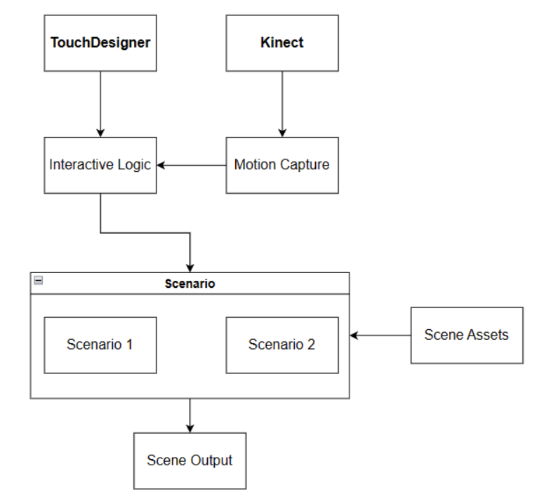

- User actions captured by Kinect device will be converted into data and sent to TouchDesigner as input of interaction logic.
- The scenarios are constructed in TouchDesigner and references resource files such as images and videos.
- There are two different scenarios in the system, which correspond to different interaction modes and characteristics.

## 3 Background Knowledge

### 3.1 Kinect

Kinect is a depth sensor developed by Microsoft that captures human movements and poses and converts them into digital data.

Kinect uses infrared and cameras to capture depth information and images in a scene. It can be connected to a computer via a USB interface and utilizes the Kinect SDK to process and analyze the data.

Kinect captures camera footage through infrared optics, and then its SDK uses classic machine learning algorithms to identify the human presence in the footage. It further recognizes the joints of the human body based on the identified individuals and captures the positions, depths, motion trajectories, and other information related to the human joints.

#### 3.1.1 Infrared Optical Principle

Kinect utilizes an infrared optical principle called structured light to obtain depth information from the scene. It emits infrared light beams and records the reflections of these beams after they pass through objects to calculate the distance between the objects and the sensor. The infrared beams emitted by Kinect are divided into hundreds of small beams, each with its own independent encoding pattern. When these beams reflect back after interacting with objects, Kinect can calculate the distance between the objects and the sensor by decoding the patterns, thus obtaining depth information about the scene.

#### 3.1.2 Machine Learning Algorithm

Kinect relies on machine learning algorithms for its target recognition and joint detection capabilities. It utilizes a machine learning algorithm called AdaBoost to identify the human body and its various joints. AdaBoost is an ensemble learning algorithm that combines multiple weak classifiers to form a strong classifier, thereby improving the accuracy of the classifier. Kinect's target recognition and joint detection functionality employ multiple AdaBoost classifiers, which, through learning from a large amount of human body data, can accurately identify the human body and its various joints.

The following picture shows the training process of AdaBoost algorithm.

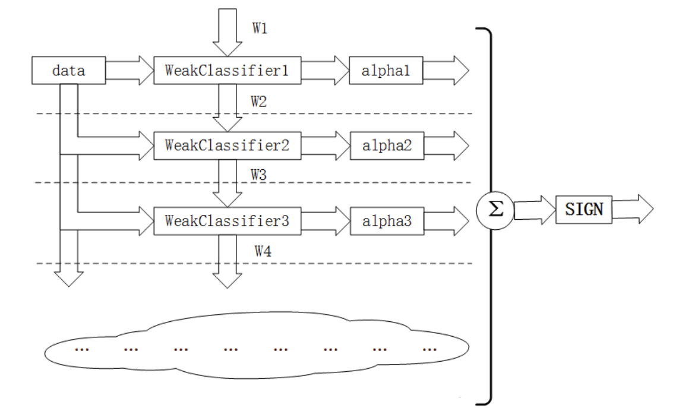

#### 3.1.3 Skeleton Model

The target recognition and joint detection capabilities of Kinect also rely on a skeleton model. The skeleton model is a virtual representation of the human body's skeleton, composed of multiple joints and bones, accurately reflecting the posture and movements of the human body. Kinect utilizes a technology called skeleton tracking, which involves analyzing depth information and RGB images in the scene to calculate the pose and movements of the human body, mapping them onto the skeleton model. Through the skeleton model, Kinect can recognize various joints of the human body and detect their motion and changes.

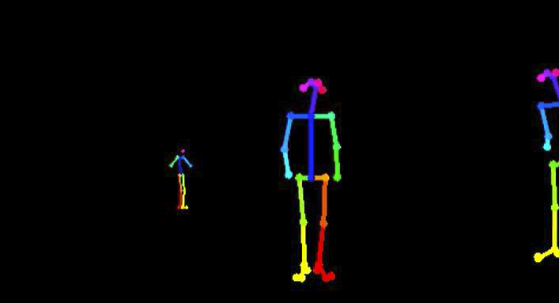

### 3.2 TouchDesigner

TouchDesigner is a visually-oriented programming environment used to create interactive and real-time audio and video applications.

#### 3.2.1 CHOP(Channel Opearetor)

CHOP is a type of node in TouchDesigner that is specifically designed for handling and manipulating channel data. Channel data refers to a series of numeric values over time, such as audio, sensor data, motion trajectories, etc. CHOP nodes can perform various operations, including mathematical calculations, filtering, interpolation, blending, and temporal processing. They can be used to process data from different devices or sensors and convert them into other formats for use by other nodes or modules. CHOPs are widely used in TouchDesigner for applications such as audio processing, motion tracking, and data visualization.

#### 3.2.2 TOP(Texture Opearetor)

TOP is a type of node in TouchDesigner that is used for handling and manipulating image, texture, and pixel data. TOP nodes can load, generate, and transform image data, as well as perform various image operations such as color correction, filter effects, image composition, texture mapping, etc. TOP nodes can also be connected to other nodes to use image data for rendering, animation, video synthesis, and other tasks. TOPs are widely used in TouchDesigner for applications such as image processing, real-time visual effects, video synthesis, and more.

#### 3.2.3 Kinect CHOP

The Kinect CHOP is a node used to read skeletal data from Kinect sensors. It can convert the skeletal data captured by Kinect sensors into CHOP data, which can be used for applications such as motion capture and real-time motion analysis. The Kinect CHOP also supports operations such as filtering, transformation, and analysis of skeletal data, making it suitable for a variety of applications.

It is important to note that using the Kinect node requires connecting a Kinect sensor and installing the corresponding driver software and libraries. Additionally, the Kinect node requires some configuration and parameter settings, such as selecting the sensor type, setting the resolution of depth images, choosing the skeleton tracking mode, and so on.

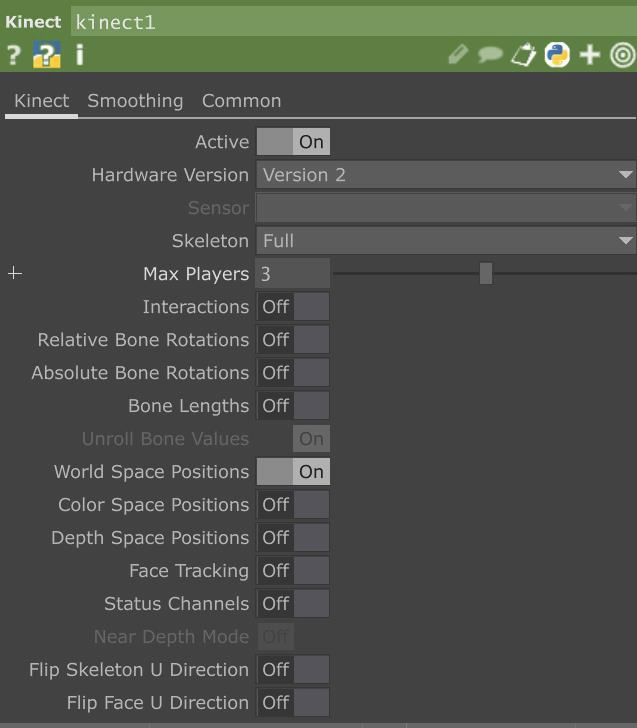

## 4 Detailed Design

### 4.1 Scenario 1

#### 4.1.1 User Interface

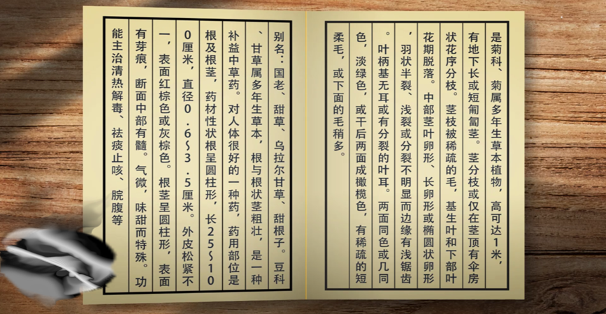

- Scenario 1 is an immersive book reading experience where users can flip through the pages of a book by moving their hands to the left or right. 
- The content of the book is "Compendium of Materia Medica," allowing users to learn traditional Chinese medicine knowledge while reading.

#### 4.1.2 Input Module

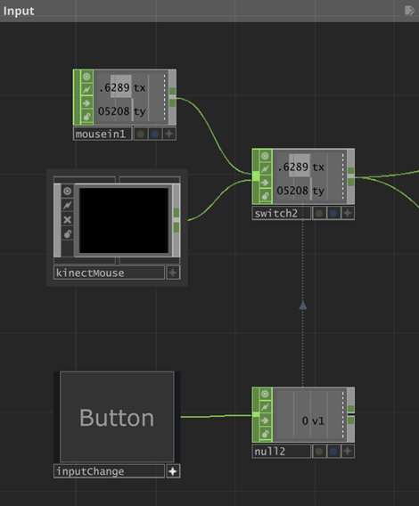

- The input module has two input types: mouse position input and Kinect hand position input, which can be quickly switched by buttons
- Mouse position input is used for quick debugging during development, while Kinect hand position input is used for actual project use

#### 4.1.3 Mouse Point Module

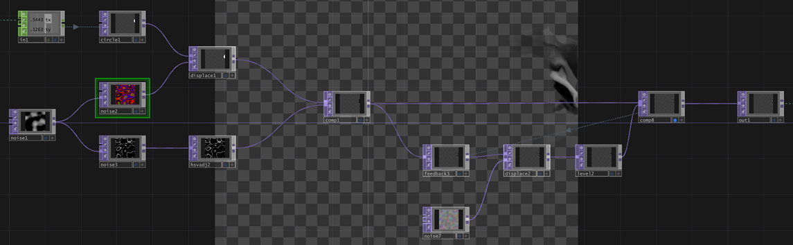

- After the system recognizes the user's hand information, there will be objects similar to the mouse pointer to interact with the user. Since the Touch Designer is very good at 2D image processing, the mouse pointer is designed as an ink style pointer, which is more cultural

#### 4.1.4 Movement Detection Module

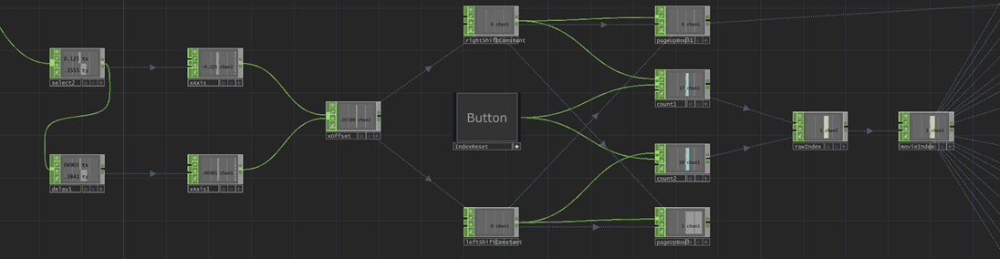

- The system needs to detect the movement of the user's hand and correspond it to the signal of turning the page forward or backward
- The judgment logic is that if the absolute value of the horizontal displacement of the user's hand movement exceeds 70% of the horizontal length of the screen within 1s, it is considered to be an effective operation, and the page is turned forward or backward according to the direction of the displacement

#### 4.1.5 Page Turning Module

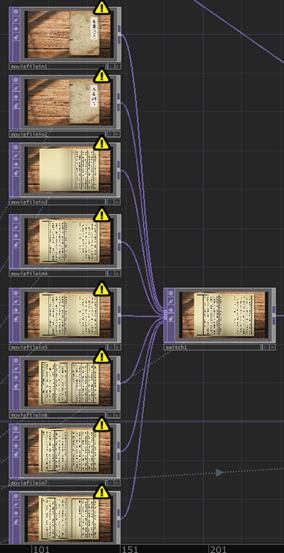

- Book turning is done by switching between different videos
- Book videos are created using Adobe After Effects (AE)

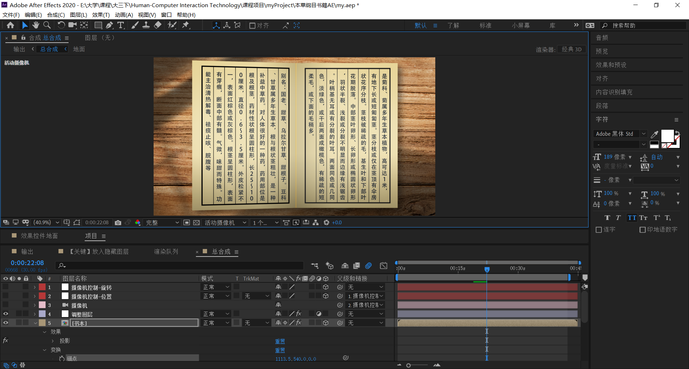

### 4.2 Scenario 2

#### 4.2.1 User Interface

- Scene 2 is similar to the "hide and seek" scene, consisting of two layers of images stacked, the former layer of images mainly of vegetation, the latter layer of images mainly of insects
- When the user moves the hand, it will see from the first image to the first image, thus achieving the effect of looking for insects in the grass and trees
- After the user finds the insect, the hand is changed from open to clenched, simulating the action of "catching the insect", and the system will display the detailed information of the insect on the screen
- Since many insects are also traditional Chinese medicine, users can learn about traditional Chinese medicine in the process of playing

#### 4.2.2 Input Module

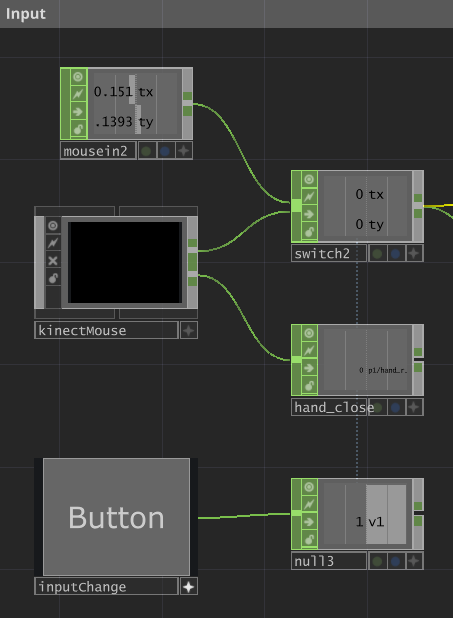

- The input module has two input types: mouse position input and Kinect hand position input, which can be quickly switched by buttons
- Mouse position input is used for quick debugging during development, while Kinect hand position input is used for actual project use
- Added the detection of the user's hand status and recorded using the status variable

#### 4.2.3 Background Module

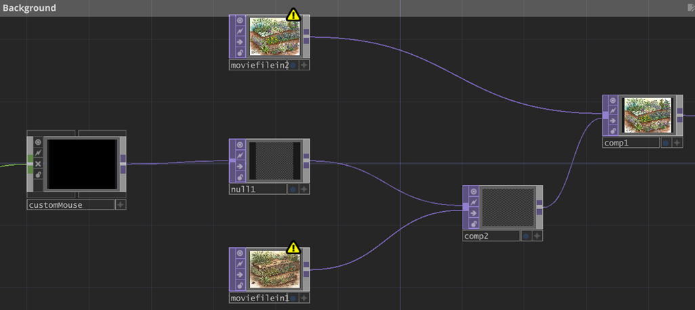

- The two layers and the mouse cursor layer are stacked sequentially using the Composite node to create a perspective effect where the mouse moves

#### 4.2.4 Position selection Module

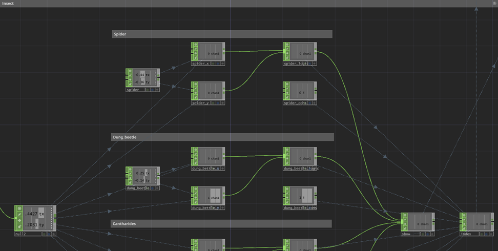

- Since there are many insects in the scene, it is necessary to distinguish, so the position of each insect is recorded, and the current position of the user's hand is constantly detected
- If the horizontal and vertical distance between the two is within a certain threshold, the user is judged to have successfully selected the insect at that location

#### 4.2.5 Description Module

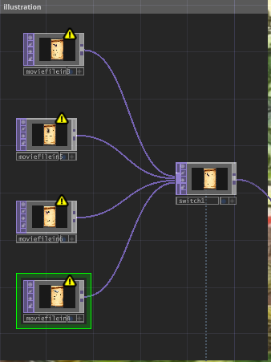

- When the user successfully locates the location of the insect and clenches the palm, the system will select the corresponding insect information to display on the screen
- The detailed information of the insects is made using Photoshop

## 5 Advantages and Disadvantages

### 5.1 Advantages

1. **Integration of Kinect depth camera:** By incorporating Kinect depth camera, the system enables users to interact with the virtual space or pictures of the space. This allows for a unique and immersive interaction experience, where users can physically engage with the virtual environment using their gestures and movements.
2. **Wide range of application scenarios:** The system can be easily set up in various public spaces such as cultural parks and people's squares. This expands the potential user base and attracts tourists to interact with the system, offering an interactive and entertaining experience in public settings.
3. **Education through entertainment:** The system utilizes a fun and engaging approach to teach users about Traditional Chinese Medicine (TCM) and enhance their understanding of Chinese herbal medicine. By making the learning process enjoyable and interactive, users are more likely to be interested and actively engage with the educational content.

### 5.2 Disadvantages

1. **Limited interaction methods:** The current system may only be able to achieve user interaction with virtual spaces or images through the Kinect depth camera. This limitation could restrict the diversity and flexibility of interaction methods, potentially failing to meet the personalized needs of certain users or specific scenario requirements.

2. **Device dependency and limitations:** The system currently relies on specific interaction devices such as the Kinect depth camera. This reliance may impose constraints on the availability and performance of the devices, limiting the system's usage scope and user experience. Additionally, these devices may require specific installation and configuration, introducing certain requirements and restrictions for users and locations.

## 6 Improvement Approach

1. **Scene expansion:** The system can expand its range of scenes to allow users to interact and experience in a broader range of environments. This involves designing and building new virtual environments, real-world simulations, or game scenarios to cater to different user needs and interests.
2. **Development of novel interaction methods:** The system can develop new interaction methods, such as multi-user real-time interaction, collaborative interaction involving multiple joints, and motion synthesis. This can be achieved by integrating interaction devices like gesture recognition devices (e.g., Leap Motion), temperature and humidity sensors using Arduino, and speech recognition, enabling diverse and rich interaction possibilities.
3. **Device integration:** The system can integrate multiple interaction devices to enhance user-system interaction capabilities. For example, incorporating gesture recognition devices like Leap Motion enables gesture-based interaction, utilizing Arduino's temperature and humidity sensors for environment sensing and response, and integrating speech recognition for voice interaction. Such integration offers a wider range of interaction methods and enriches the user experience.
4. **User feedback and requirement collection:** The system can establish feedback mechanisms to gather user opinions, suggestions, and requirements. This enables continuous improvement of the system based on user feedback, optimizing and enhancing it to provide a better user experience and meet user needs.
5. **Technological research and innovation:** The system can engage in research and innovation to explore new interaction technologies and methods. This includes exploring fields like virtual reality, augmented reality, natural language processing, and machine learning to improve system performance, intelligence, and user-friendliness.

By implementing these improvement methods, the system can continuously enrich and enhance itself, offering a wider range of scenes and interaction methods, creating more possibilities for interaction, and satisfying diverse user needs and expectations.

## 7 Contribution of each member

Yifei Liu 100%
