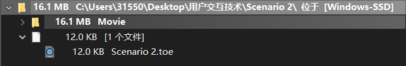
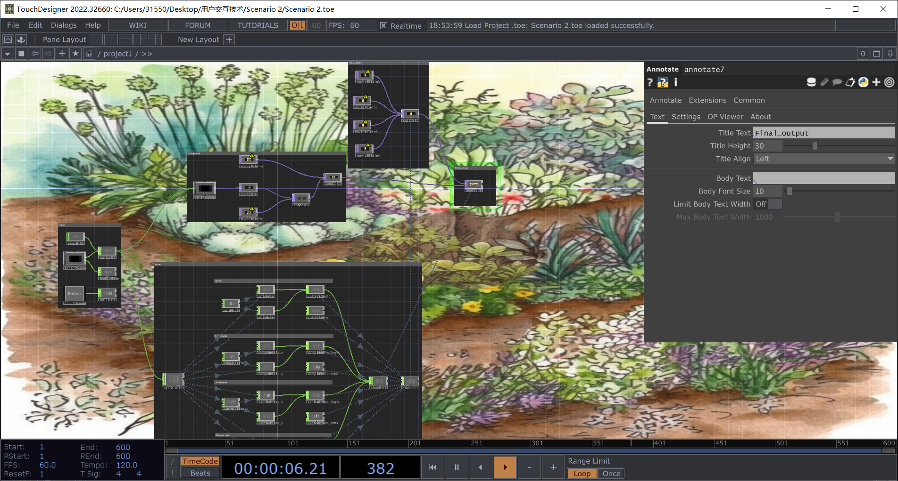
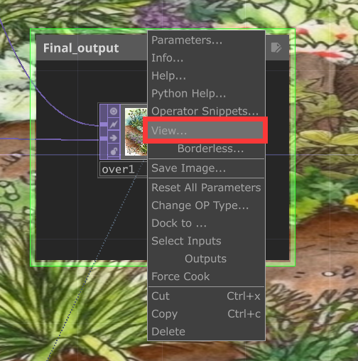

# How To Run

1. Make sure that the project resources folder exists and is the same as the toe file. The file directory should be as follows:

2. Install TouchDesigner and connect Kinect
   - The official TouchDesigner installation path is： https://derivative.ca/download
   - The depth camera model used in this system is Microsoft Kinect for Windows V2.0
3. Run the 'toe' file and open TouchDesigner, and the program will automatically connect to Kinect and obtain sensor information. The successful operation interface is as follows:

4. Click the total composition node on the far right and select view

5. Successfully run project